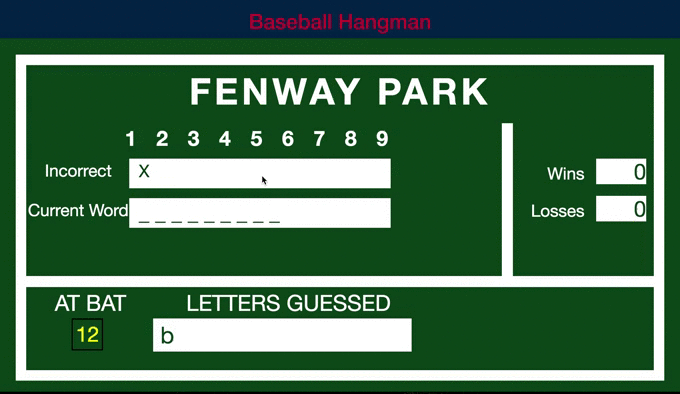

# Baseball Hangman

### Overview

Browser based Hangman game themed around Baseball words.

## Rules & Features

* Each game, the user is given a word to try and guess the letters correctly.

* Each game, the user gets 9 in correct guess or they lose.

* Key events listen for eithr correct or incorrectly guessed letters.

* After the user wins/loses the game automatically chooses another word.

* **Bonus Feature** Design is to replicate the legendary Fenway Park Scoreboard.

# Demo

  
# History

Created on 5/4/17

# License

MIT